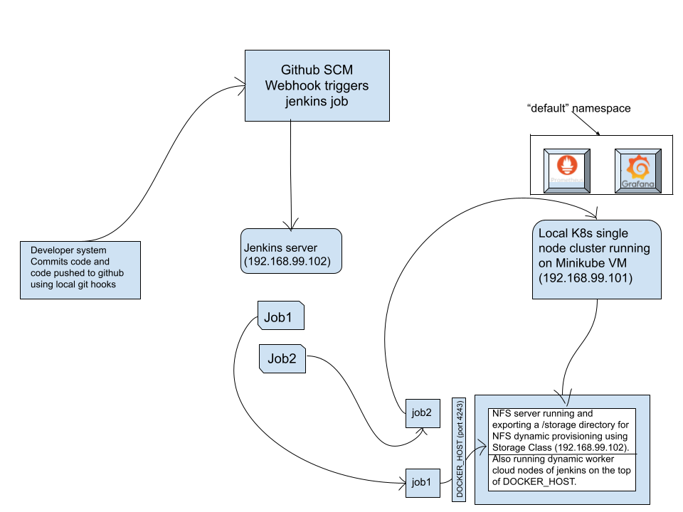
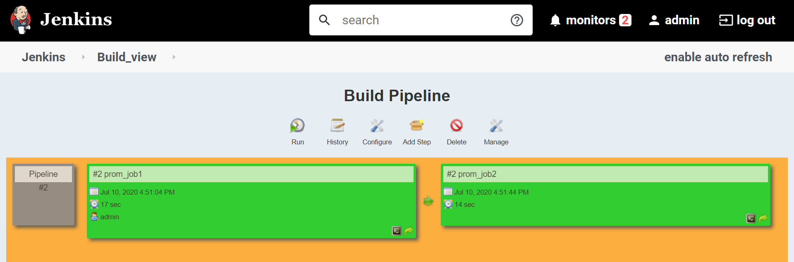

# Integration of Prometheus & Grafana on K8s deployed using Jenkins Dynamic Slaves.

Prerequisites:-
A pre-installed K8s cluster(e.g. minikube). In minikube by default, there is no
internal NFS dynamic provisioner is available for the storage class so it can claim a PVC or PV dynamically. so we are creating a NFS-client dynamic provisioner in the K8s cluster using a service account, cluster roles, etc., which basically uses RBAC (role-based access controls) Authorization.
follow this repo for creating NFS-client dynamic provisioner in the K8s cluster using a service account, cluster roles, etc.
https://kubernetes.io/docs/tasks/configure-pod-container/configure-service-account/
https://kubernetes.io/docs/reference/access-authn-authz/rbac/
Also, install Github, Build Pipeline Plugin in Jenkins.
For creating cloud nodes using Docker(install Docker plugin in Jenkins)
then create a DOCKER_HOST (install docker, start and enable its services).
[For creating private docker registry, follow my article](https://www.linkedin.com/pulse/docker-private-registry-v2-minikube-k8s-vm-ankur-dhakar/?trackingId=UjrWKs3ZTf67GvqaIcwDlQ%3D%3D)

[And for creating Integration of K8s, GitHub, and Jenkins Dynamic Slaves
follow my article](https://medium.com/@A4ANK/integration-of-k8s-github-and-jenkins-d37ebb768dfe)

## Tasks to be created:-
1. Deploy Prometheus and Grafana as pods on top of K8s by creating resources Deployment, ReplicaSet, Pods, and Services ,etc. using Jenkins Jobs running on Jenkins Dynamic Slaves.
2. And make their data to be remain persistent using config maps, persistent volume claims and persistent volumes.
3. And both of them should be exposed to outside world using Services.

## Solutions:-
Create two Jenkins Job to complete this task as follows:-
## Job1
Pull the Github repo automatically when some developers push repo to Github(using local hooks and web-hooks) and perform the following operations as:
1. Pull Github repository containing K8s manifest files and copy them into a centralized NFS server (192.168.99.102).
2. Trigger the Job2.

## Job2
Job2 will be trigger by Job1 on it’s successful build.
1. Deploy Prometheus and Grafana as pods on top of K8s by creating resources Deployment, ReplicaSet, Pods, and Services ,etc. using Jenkins Jobs running on Jenkins Dynamic Slaves.
2. And make their data to be remain persistent using config maps, persistent volume claims and persistent volumes.
3. And both of them should be exposed to outside world using Services.

`
echo "prometheus tasks are started"
if  kubectl get cm prometheus-config-file-volume  
then 
    echo "config map already created and applying the latest changes"
    kubectl create configmap  prometheus-config-file-volume  --from-file=/storage/prometheus.yml -o yaml --dry-run=client | kubectl replace -f -
else
    kubectl create configmap  prometheus-config-file-volume  --from-file=/storage/prometheus.yml
    echo "config map created for premetheus config file"
fi
if kubectl get svc prometheus-svc 
then 
    echo "prometheus service is already created and applying latest changes"
    kubectl apply -f  /storage/prometheus-svc.yml
else
    kubectl apply -f  /storage/prometheus-svc.yml
    echo "creating prometheus service"
fi
if kubectl get pvc prometheus-storage-pvc
then 
    echo "prometheus pvc is already created and applying latest changes"
    kubectl apply -f  /storage/prometheus-pvc.yml
else
    kubectl apply -f  /storage/prometheus-pvc.yml
    echo "creating prometheus pvc"
fi
if kubectl get deploy prometheus-deployment
then 
    echo "prometheus deployment is already created and applying latest changes"
    kubectl apply -f  /storage/prometheus-deployment.yml
else
    kubectl apply -f  /storage/prometheus-deployment.yml
    echo "creating prometheus deployment"
fi
echo "prometheus tasks are ended"
echo "grafana tasks are started"
if kubectl get svc grafana-svc
then 
    echo "grafana-svc is already created and applying latest changes"
    kubectl apply -f  /storage/grafana-svc.yml
else
    kubectl apply -f  /storage/grafana-svc.yml
    echo "creating grafana-svc service"
fi
if kubectl get pvc grafana-storage-pvc
then 
    echo "grafana-storage-pvc is already created and applying latest changes"
    kubectl apply -f  /storage/grafana-pvc.yml
else
    kubectl apply -f  /storage/grafana-pvc.yml
    echo "creating grafana-storage-pvc"
fi
if kubectl get deploy grafana-deployment
then 
    echo "grafana-deployment is already created and applying latest changes"
    kubectl apply -f  /storage/grafana-deployment.yml
else
    kubectl apply -f  /storage/grafana-deployment.yml
    echo "creating grafana-deployment"   
fi
echo "grafana tasks are ended"
`

## Now we can access our Prometheus services and Grafana services.

###### By default, Grafana Dashboard login credentials are:-
username:- admin
password:- admin

###### Now we can add data sources e.g. Prometheus(T.S.D.B metric DB)

## Since Data source is added so now we can create our visual or dashboard in Grafana or else we can use a pre-created dashboard or visuals for monitoring Prometheus data source.

## So, now we have created our data persistent in our centralized NFS server(192.168.99.102).

`
[root@server ~]# ls /storage/
default-grafana-storage-pvc-pvc-0ccdd2d9-6008-4947-a895-b7d9d359e475
default-prometheus-storage-pvc-pvc-125fb35e-f5a8-4d58-b2e1-bc445dcbcd12

[root@server ~]# ls /storage/default-prometheus-storage-pvc-pvc-125fb35e-f5a8-4d58-b2e1-bc445dcbcd12/
chunks_head  lock  queries.active  wal

[root@server ~]# ls /storage/default-grafana-storage-pvc-pvc-0ccdd2d9-6008-4947-a895-b7d9d359e475/
grafana.db  plugins  png
`
P.S.- Any questions or suggestions are welcome.
